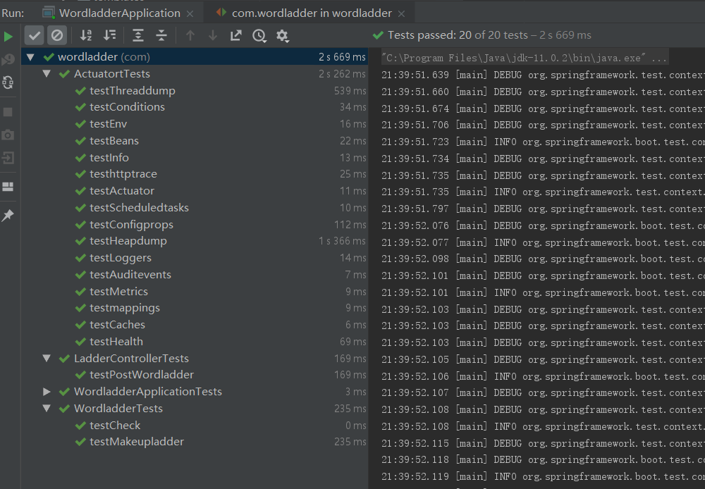

# Hw2
## Set up
该工程没有前端（用postman代替），因此仅需要启动后端即可

``` bash
cd Wordladder
mvn spring-boot:run
```
看见如下界面则启动成功：


## Project Architecture


### Dictionary文件夹
存放wordladder所用的dictionary.dictionary.txt为大的dictionary而smallladder.txt为用于debug的小dictionary.
### Controller
* Wordladder.java
实现Wordladder的内部逻辑。
* WordladderApplication
启动controller
* LadderController.java
用于实现WordladderControler的内容：获取html信息，调用Wordladder类生成wordladder。
### Test
三个文件对应Controller的三个文件分别进行测试。

## Function
利用postman发送post请求和get请求，得到的结果如图：

POST请求:


GET请求：


## Unit Test
运行结果如下：

其中，WordladderTests测试后台逻辑的运行是否正确，而LadderControllerTests则利用了MockMVC来模拟post请求，对Controller进行测试。

## Git Flow
本项目作为一次练手，最后才使用git flow，也许不能发挥gitflow的效果，但主要希望能够熟悉gitflow的使用方式.
