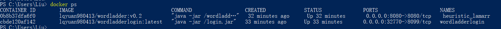
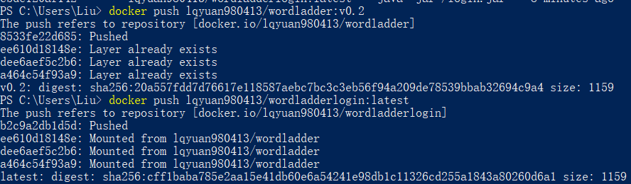
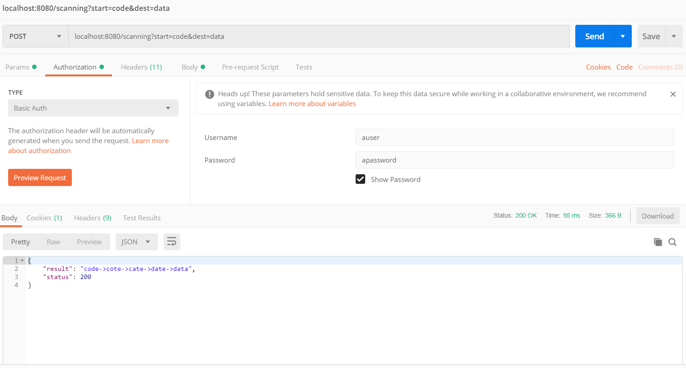
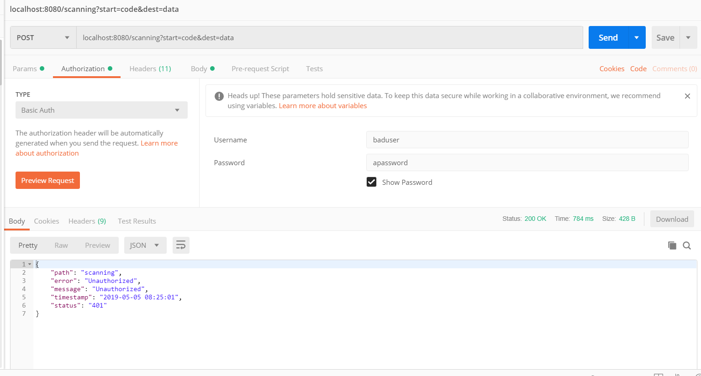

# Homework 3: Microservice
> [我的dockerhub账号](https://hub.docker.com/u/lqyuan980413)
## 微服务结构
### Login
位于./login文件夹内。
### Wordladder 
位于../Hw2/Wordladder文件夹内。
### 交互逻辑
* 暴露wordladder接口，用户将登陆信息（Username和password）置于Request Header中发送给wordladder。Postman 的 basic author将username:password 字符串以Base64格式编码后加到header里面。
* wordladder接收到信息后解析接收到的登陆信息，并加到Request body里面发送给login service验证用户信息。
* 如果用户信息有效则输出结果，否则输出401 Unauthorized。

## Docker操作
进入login文件夹：
``` powershell
docker build -t lqyuan980413/wordladderlogin:latest .
docker run -itd -P --name=wordladderlogin lqyuan980413/wordladderlogin:latest
```
进入wordladder文件夹：
``` powershell
docker run -itd -p 8080:8080 --link=wordladderlogin:wordladderlogin lqyuan980413/wordladder:v0.2
```
查看运行情况：
``` bash
docker ps 
```



上传至dockerhub：
``` bash
docker push lqyuan980413/wordladder:v0.2
docker push lqyuan980413/wordladderlogin:latest
```

## Test
利用postman发送http请求至wordladder服务，输入正确的账号密码：



输入错误的账号密码或者不输入：

