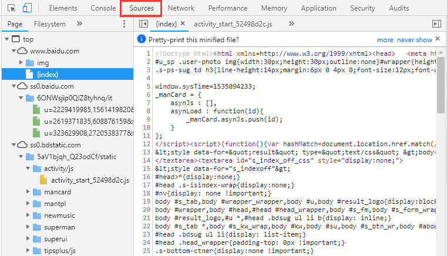
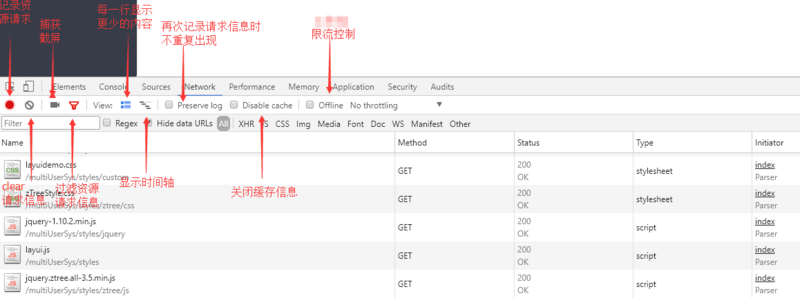
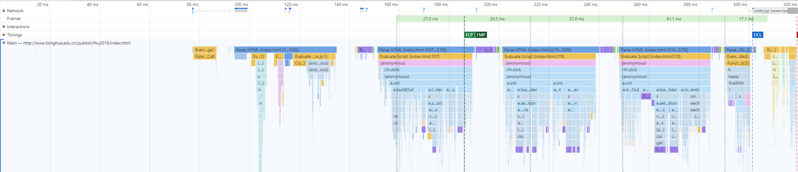

# task1
## Investigate F12
### Elements Page
Element页面对应页面的HTML结构，双击可以对某个元素的属性，css等进行调整。左上角选择元素（也可以ctrl+shift+c）可以在页面上选定元素，定位到该元素在HTML中的位置。

### Console
Console页面为控制台，能够查看js对象及其属性，或者执行JS语句。此外，也可以查看控制台日志。

### Source
Source页面为源代码，左边可以查看源文件，以树状表示。

此外，在源文件可以添加断点，进行调试。右上角为调用栈等调试信息。

### Network

Network页面从左到右这样几个按钮：
* 记录按钮：处于打开状态时会在此面板进行网络连接的信息记录，关闭后则不会记录。
* 清除按钮 清除当前的网络连接记录信息。（点击一下就能清空）
* 捕获截屏 记录页面加载过程中一些时间点的页面渲染情况，截图根据可视窗口截取，如下图所示。

* 过滤器 能够自定义筛选条件，找到自己想要资源信息，如下图所示。

* 显示详细信息
* 显示时间流

表格内内容如下：
* Name:资源名称以及URL路径
* Method：Http请求方法 (GET或者POST)
* status/Text：Http状态码/文字解释 （200，ok）
* Type ：请求资源的类型
* Initiator：解释请求是怎么发起的，有四种可能的值
> 1. Parser：请求是由页面的html解析时发送 
> 2. Redirect：请求是由页面重定向发送
> 3. script：请求是由script脚本处理发送
> 4. other：请求是由其他过程发送的，比如页面里的Link链接点击
* size：size是响应头部和响应体结合的大小
* Timing：资源请求花费的时间
### Performance
以下对各大高校主页的比较分析主要利用该界面，因此暂且略过。

## Investigate the homepage of SJTU
### Comparation with other pages
> 比较对象为清华大学主页和复旦大学主页
1. 加载时间比较
> 从开始载入到onload
* 清华主页：283ms
* 复旦主页：318

* 交大主页：1.11ms
可以看出，交大主页的载入速度是最慢的。
2. Performance比较
> 从开始载入到onload，比较Event:
* 清华主页：
* 复旦主页：
* 交大主页：

由图片可见，SJTU主页的DCL花了太多的时间，成为了载入时间上的瓶颈。

### Suggestions on optimization
#### 1. 压缩图片数量及清晰度
交大主页的图片量较大，因此导致其载入时间较长。因此，可以通过压缩图片（包括数量及清晰度）的方法来优化网页的加载速度。
#### 2. 优化加载顺序
交大主页非常长，因此刚进入主页界面的时候，许多部分是第一时间不可见的。因此可以先载入可见的部分，再载入不可见的部分，使得整个载入过程在感觉上更快。