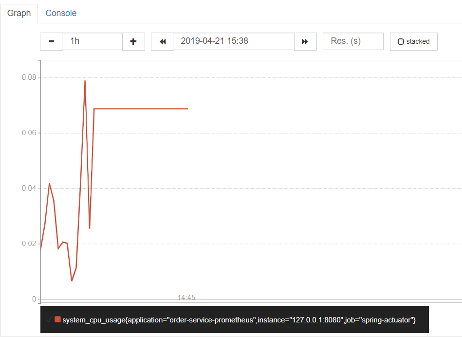
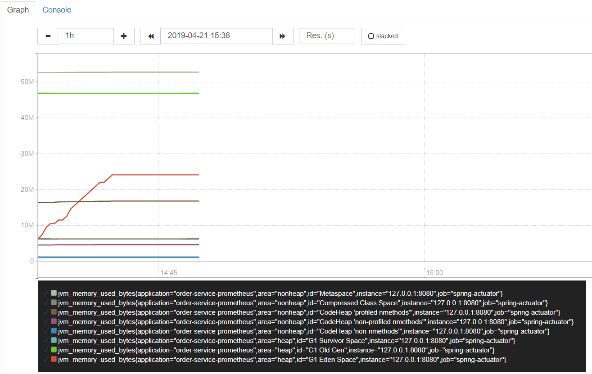
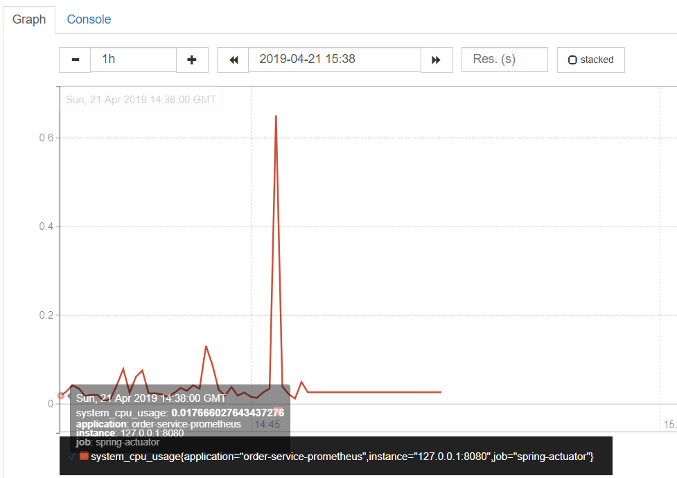
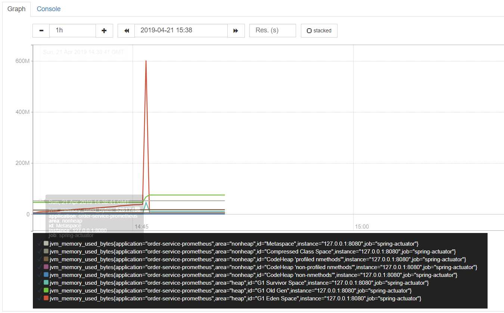
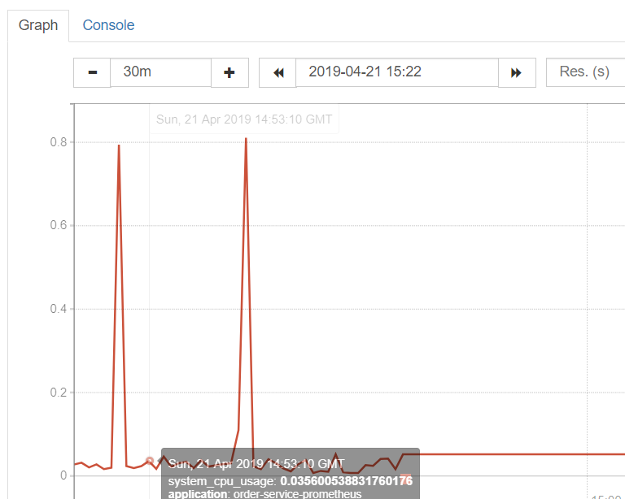
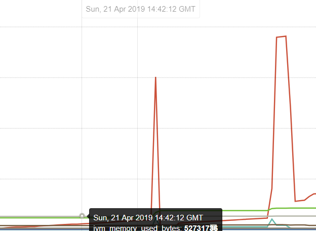
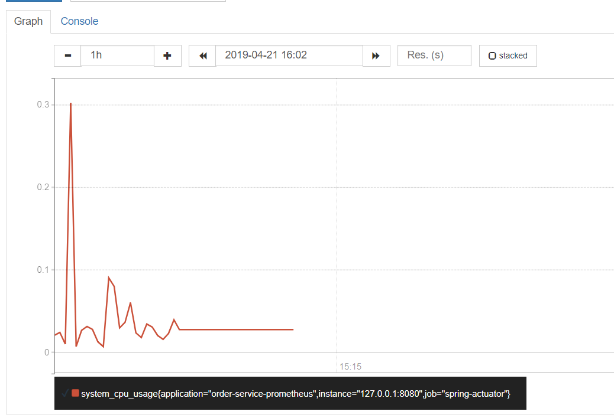
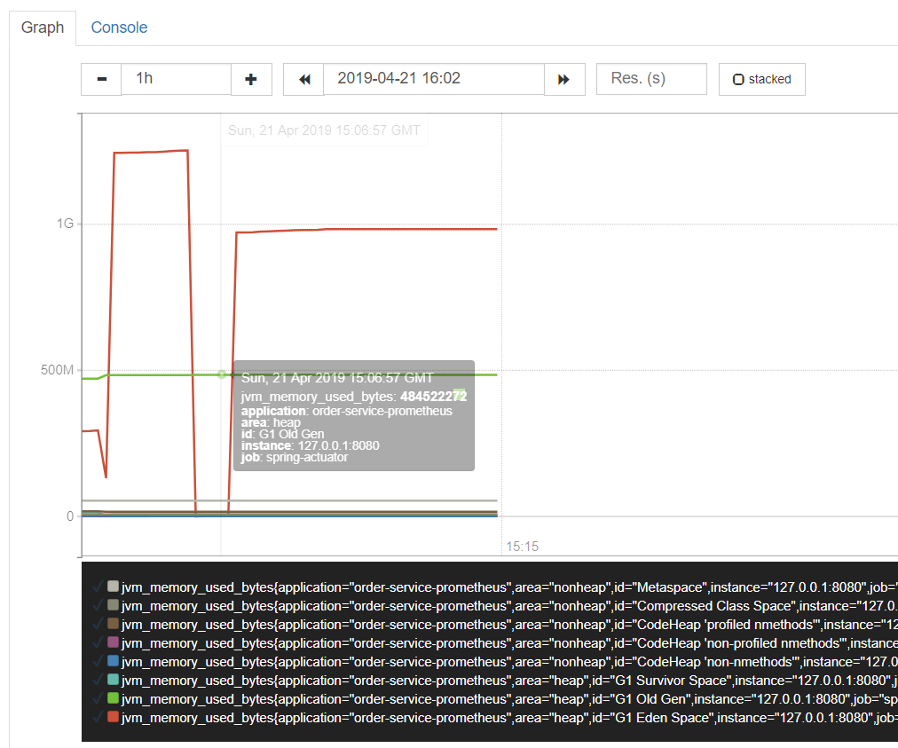

# Task 2 
> 使用JMeter监控服务器的CPU，内存，网络等资源占用情况

## 环境
Prometheus + Spring Actuator. 

## 无request时的资源使用
* CPU

* Memory

可以看到，无论是CPU还是Memory的consumption，均在很小的范围内摆动。

## 利用JMeter发送大量请求进行压力测试
### 同时发送100个请求
> 请求需要得到code->data的wordladder

* CPU

* Memory

可以看到，在很短的时间内，cpu和memory的使用量发生了突然的耸动。

### 在1s内发送100个请求 

* CPU

* Memory

由两张图可以看出，memory和cpu的使用情况仍然出现了耸动，但是峰值同之前相差不大，耸动的持续时间略有所增加。（这点在memory里面看的格外清楚）

### 在10s内发送1000个请求
这次试验我们先刷新界面，将1s内100个request和10s内1000个request进行对比。
首先是10s内发送1000个请求，然后是1s内发送100个，得到的结果如下：

* CPU

* Memory

这次的结果颇有意思。对于CPU而言，两次访问的CPU consumption差别非常大，第一次远高于第二次。而对于Memory而言，在第二次request以后，内存里的数据一直存在，保存了非常高的使用量（甚至怀疑是不是因为java的内存泄漏）。