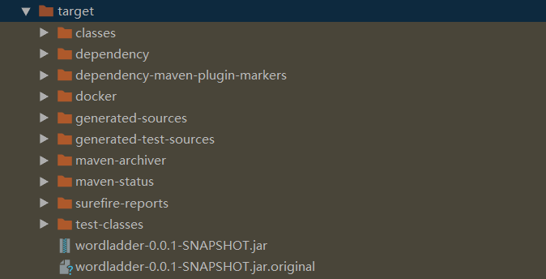
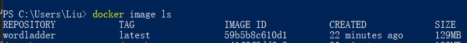
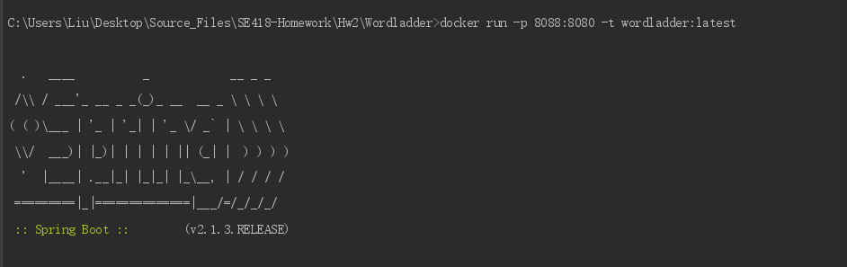
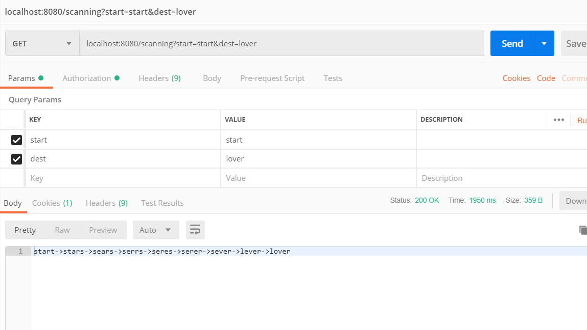
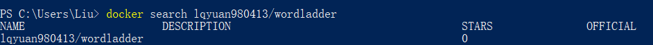
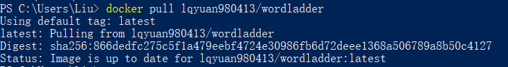

# Task 3

## Install Docker
首先更新Win10系统至专业版（家庭版不支持Hyper-V从而不支持docker下载），得到Docker Desktop


打开它，登陆，看到消息栏里的docker图标，则可以在命令行（powershell）使用docker命令了。

## Deploy WordLadder Service
首先生成jar包：
``` bash
mvn install
```
生成target文件夹。内有jar包如图：



创建Dockerfile文件如下：

``` dockerfile
FROM openjdk:8-jdk-alpine
MAINTAINER LQY
EXPOSE 8080
COPY ./target/wordladder-0.0.1-SNAPSHOT.jar /wordladder.jar
ENTRYPOINT [ "java", "-jar", "/wordladder.jar" ]
```
运行生成image:
``` bash
docker build -t wordladder:latest .
```
此时可以用这样的指令看到已生成的image：



之后便可以运行docker服务：
``` bash
docker run -p 8088:8080 -t wordladder:latest
```
效果如下：



此时服务成功运行。

## Test
利用postman测试运行效果：



可知Service成功运行。

## Push to dockerhub
之前image的名称是wordladder，不符合dockerhub的tag命名要求。我的用户名是lqyuan980413，因此首先修改image的tag,再进行docker push。
``` bash
docker tag wordladder lqyuan980413/wordladder
docker push wordladder:latest
```
之后确认上传成功：
``` bash
docker search lqyuan980413/wordladder
```


从仓库获得push成功的image：
``` bash
docker pull lqyuan980413/wordladder
```

